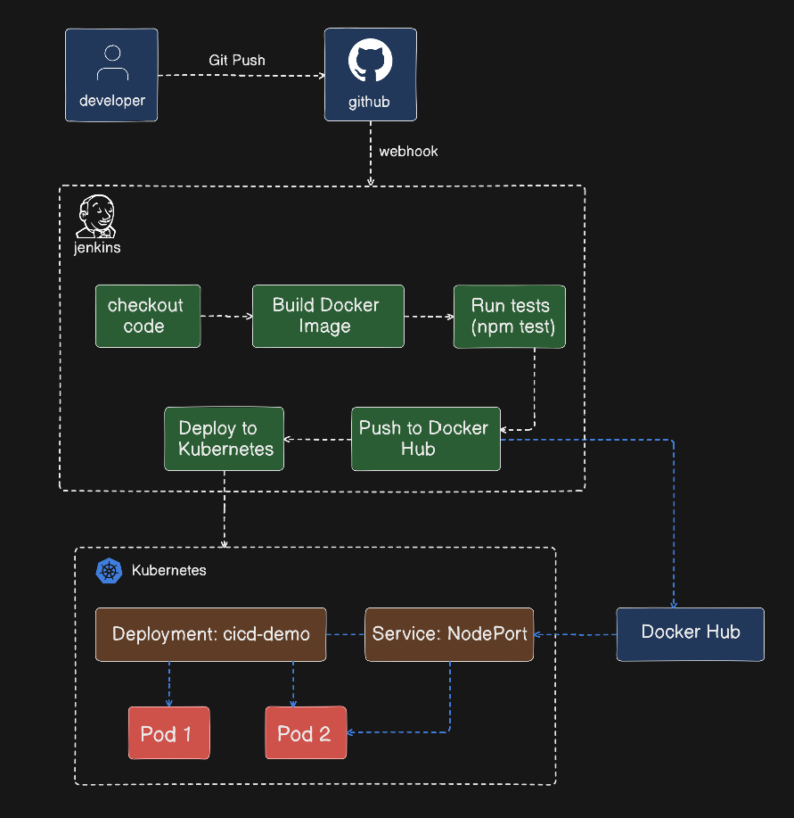
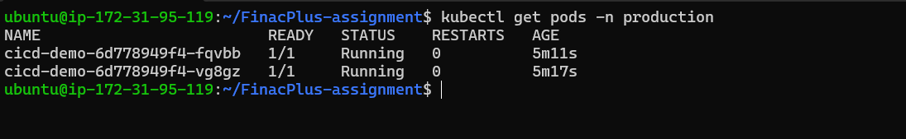
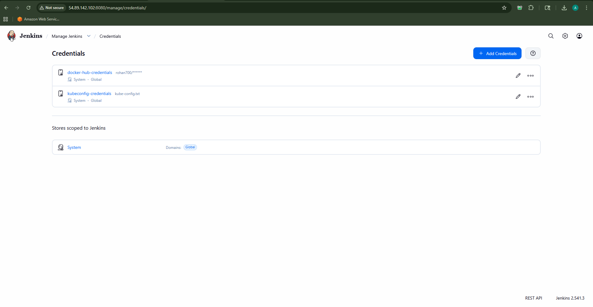
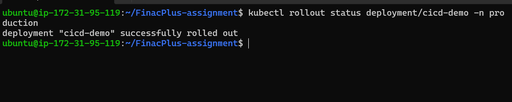
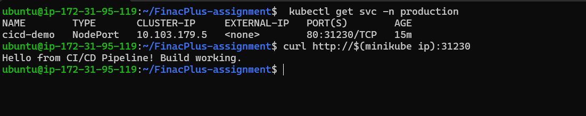
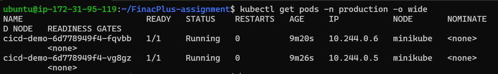
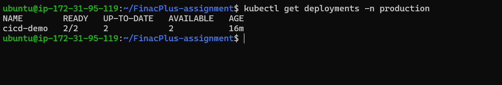
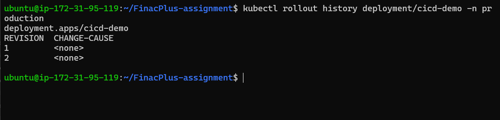

# CI/CD Pipeline Assignment
Git + Jenkins + Kubernetes on AWS EC2

Submitted by: Ruhon Deb  
GitHub: https://github.com/rohandeb2/FinacPlus-assignment  
Docker Hub: rohan700  
Date: April 2026

---

## What This Project Does

This project sets up a CI/CD pipeline that automatically builds and deploys an application whenever code is pushed to GitHub.

The flow:
1. Developer pushes code to GitHub
2. GitHub sends a webhook to Jenkins
3. Jenkins builds a Docker image
4. Jenkins runs tests inside the container
5. Jenkins pushes the image to Docker Hub (rohan700/my-app:v1)
6. Jenkins deploys the new image to Kubernetes
7. Kubernetes does a rolling update with zero downtime

---

## Architecture Diagram

<div align="center">
  
</div>

---

## Tools Used

- AWS EC2 (Ubuntu 22.04) - server to run everything
- Jenkins LTS - CI/CD automation
- Docker - build and package the app
- Minikube - local Kubernetes cluster
- kubectl - deploy to Kubernetes
- GitHub - source code and webhooks
- Docker Hub - store Docker images
- Node.js 20 (Alpine) - sample application

---

## Project Structure

```
FinacPlus-assignment/
├── Jenkinsfile            <- 5-stage Jenkins pipeline (Groovy)
├── Dockerfile             <- how to build the Docker image
├── package.json           <- Node.js dependencies
├── src/
│   └── index.js           <- simple Node.js web app
└── k8s/
    ├── deployment.yaml    <- Kubernetes Deployment
    └── service.yaml       <- Kubernetes Service (NodePort)
```

---

## How to Set Up

### Step 1 - Launch EC2

Create Ubuntu 22.04 EC2 instance. Open ports: 22, 8080, 443, 5000, 30000-32767.

```bash
chmod 400 your-key.pem
ssh -i your-key.pem ubuntu@YOUR_EC2_PUBLIC_IP
```

### Step 2 - Install Everything

```bash
# Update
sudo apt-get update -y && sudo apt-get upgrade -y

# Java
sudo apt install -y fontconfig openjdk-21-jre

# Jenkins
sudo wget -O /etc/apt/keyrings/jenkins-keyring.asc \
  https://pkg.jenkins.io/debian-stable/jenkins.io-2026.key
echo "deb [signed-by=/etc/apt/keyrings/jenkins-keyring.asc]" \
  https://pkg.jenkins.io/debian-stable binary/ | sudo tee \
  /etc/apt/sources.list.d/jenkins.list > /dev/null
sudo apt update && sudo apt install -y jenkins
sudo systemctl start jenkins && sudo systemctl enable jenkins

# Docker
sudo apt-get install -y ca-certificates curl gnupg
sudo install -m 0755 -d /etc/apt/keyrings
curl -fsSL https://download.docker.com/linux/ubuntu/gpg \
  | sudo gpg --dearmor -o /etc/apt/keyrings/docker.gpg
sudo apt-get update -y
sudo apt-get install -y docker-ce docker-ce-cli containerd.io
sudo usermod -aG docker jenkins
sudo usermod -aG docker ubuntu
sudo systemctl restart docker

# kubectl
curl -LO "https://dl.k8s.io/release/$(curl -sL https://dl.k8s.io/release/stable.txt)/bin/linux/amd64/kubectl"
sudo install kubectl /usr/local/bin/kubectl

# Minikube
curl -LO https://storage.googleapis.com/minikube/releases/latest/minikube-linux-amd64
sudo install minikube-linux-amd64 /usr/local/bin/minikube

# Git
sudo apt-get install -y git

# Restart Jenkins
sudo systemctl restart jenkins
```

### Step 3 - Configure Jenkins

1. Open http://YOUR_EC2_IP:8080
2. Unlock with: `sudo cat /var/lib/jenkins/secrets/initialAdminPassword`
3. Install suggested plugins
4. Install extra plugins: Docker Pipeline, Kubernetes CLI, Pipeline Stage View
5. Add Docker Hub credential:
   - Manage Jenkins -> Credentials -> Add Credential
   - Kind: Username with password
   - Username: rohan700, Password: YOUR_PAT_TOKEN
   - ID: docker-hub-credentials

### Step 4 - Clone Repo and Push Initial Image

```bash
git clone https://github.com/rohandeb2/FinacPlus-assignment.git
cd FinacPlus-assignment

docker build -t my-app .
docker login -u rohan700
docker tag my-app rohan700/my-app:v1
docker push rohan700/my-app:v1
```

Set up GitHub webhook:
- GitHub repo -> Settings -> Webhooks -> Add webhook
- Payload URL: http://YOUR_EC2_IP:8080/github-webhook/
- Content type: application/json
- Events: push

### Step 5 - Start Kubernetes

```bash
minikube start --driver=docker --memory=2200 --cpus=2
kubectl create namespace production

kubectl create secret docker-registry docker-registry-secret \
  --docker-server=https://index.docker.io/v1/ \
  --docker-username=rohan700 \
  --docker-password=YOUR_PAT_TOKEN \
  --namespace=production

kubectl apply -f k8s/deployment.yaml
kubectl apply -f k8s/service.yaml
kubectl get pods -n production
```

### Step 6 - Fix kubeconfig for Jenkins

```bash
sudo cp /home/ubuntu/.kube/config /var/lib/jenkins/kubeconfig
sudo chown jenkins:jenkins /var/lib/jenkins/kubeconfig
sudo chmod 644 /home/ubuntu/.minikube/profiles/minikube/client.crt
sudo chmod 644 /home/ubuntu/.minikube/profiles/minikube/client.key
sudo chmod 644 /home/ubuntu/.minikube/ca.crt
sudo chmod 755 /home/ubuntu/.minikube
sudo chmod 755 /home/ubuntu/.minikube/profiles
sudo chmod 755 /home/ubuntu/.minikube/profiles/minikube
sudo usermod -aG ubuntu jenkins
sudo systemctl restart jenkins
```

cat ~/.kube/config
Upload this file in Jenkins → Credentials → kubeconfig-credentials

Upload kubeconfig to Jenkins:
- Jenkins -> Credentials -> Add Credential
- Kind: Secret file, upload /home/ubuntu/.kube/config
- ID: kubeconfig-credentials

### Step 7 - Create Jenkins Pipeline Job

1. Jenkins Dashboard -> New Item
2. Name: cicd-demo-pipeline, Type: Pipeline
3. Build Triggers: check "GitHub hook trigger for GITScm polling"
4. Pipeline -> Pipeline script from SCM -> Git
5. Repo URL: https://github.com/rohandeb2/FinacPlus-assignment.git
6. Branch: */main, Script Path: Jenkinsfile
7. Save

### Step 8 - Trigger and Verify

Manual (first time): Click Build Now in Jenkins.

Auto (every push after):
```bash
git add .
git commit -m "your message"
git push origin main
```

Verify:
```bash
kubectl get pods -n production
kubectl rollout status deployment/cicd-demo -n production
curl http://$(minikube ip):30080
# Expected: Hello from CI/CD Pipeline! Build working.
```

---

## Pipeline Stages

| Stage | What it does |
|-------|-------------|
| Checkout | Clones latest code from main branch |
| Build Docker Image | docker build, tagged with git commit SHA |
| Run Tests | npm test inside the built container |
| Push Docker Image | pushes rohan700/my-app:v1 and :latest to Docker Hub |
| Deploy to Kubernetes | kubectl set image + waits for rollout to finish |

---

## Security Practices

- Docker Hub credentials stored in Jenkins Credentials store, never in code
- Container runs as non-root user (appuser)
- Kubernetes pod set with runAsNonRoot: true
- readOnlyRootFilesystem: true in deployment
- capabilities: drop: [ALL] in deployment
- Resource limits set on containers
- kubeconfig stored at /var/lib/jenkins/kubeconfig with jenkins:jenkins ownership

---

## Error Handling

- Every pipeline stage has try/catch for clean error logging
- On deploy failure, post { failure { } } block runs kubectl rollout undo automatically
- post { always { } } cleans up Docker image and workspace after every build

---

## Optional: Monitoring Recommendations

- Deploy Prometheus + Grafana for pod CPU/memory metrics
- Use `kubectl top pods -n production` for quick live resource check
- Add Slack/email notifications in the Jenkinsfile post{} block
- `kubectl get events -n production --sort-by=.lastTimestamp` for event logs

---

## Proof:

<div align="center">
  
</div>
<div align="center">
  
</div>
<div align="center">
  
</div>
<div align="center">
  
</div>
<div align="center">
  
</div>
<div align="center">
  
</div>
<div align="center">
  
</div>
<div align="center">
  
</div>
<div align="center">
  
</div>
<div align="center">
  
</div>
<div align="center">
  
</div>
<div align="center">
  
</div>
<div align="center">
  
</div>
<div align="center">
  
</div>
